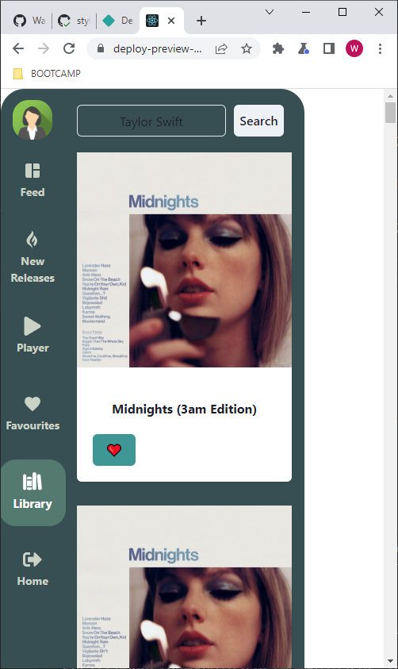
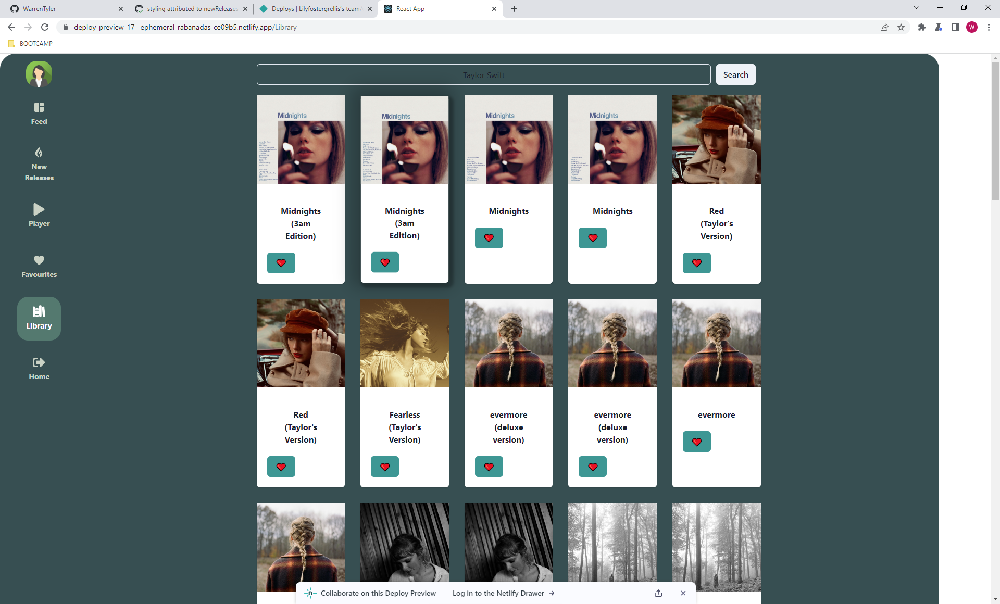

# Music Platform

## Description

Music Platform is a single page React web application using Chakra UI to give a clean and responsive layout. It makes use of the SpotifyAPI to search for all your music needs.

The user is presented with navigation to the various search features to make finding the right music easy.

### Searches include
- Albums by your favourite Artist
- New Releases
- Music Category

## Installation

This application requires [Node](https://nodejs.org/en/).
When installed use npm to install dependencies:
```bash
npm install
```

## Usage

The application will be invoked by using the following command:

```bash
npm start
```





## Credits

[Lily Foster-Grellis](https://github.com/Lilyfostergrellis)

[George Muchiza](https://github.com/gmuchiza)

[Warren Tyler](https://github.com/WarrenTyler)

## Deployment

https://ephemeral-rabanadas-ce09b5.netlify.app/

## License

N/A.

## Requiremets 
- Must use Spotify API.
- Must be responsive from mobile to large screen
- Must use Chakra CSS framework 
